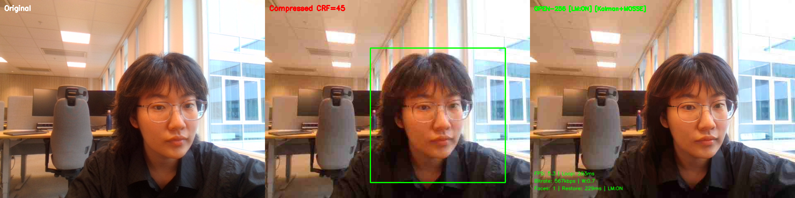
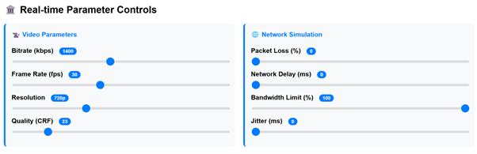

# FaceLift-Tracker

Real-time face restoration for degraded video streams using GPEN-256, with landmark-guided geometric correction and low-latency face tracking.

## Motivation

Video calls over low-bandwidth connections suffer from heavy compression artifacts blocky skin, blurred edges, and lost facial detail. Neural face restoration models like GPEN can recover impressive detail, but naively applying them in real-time introduces two critical problems:

### Problem A: Geometric Distortion

GPEN-256 tends to **distort facial geometry** during restoration edges of facial features jitter frame-to-frame, producing unstable, flickering output. This is especially severe when the subject **wears glasses**.

### Problem B: Tracking Latency

GPEN inference takes ~30–50ms per frame on CPU. During this time, if the user moves their head quickly, the face ROI from the previous detection is already stale. The restored face gets pasted at the wrong position, creating a visible "ghost face" lag effect.

## Solution

### A. Landmark-Guided Correction

Instead of trusting GPEN's output geometry blindly, I use a **detect → restore → detect → warp** pipeline:

1. Detect 22 key facial landmarks (eyes, nose, mouth) on the **original** compressed crop
2. Run GPEN-256 restoration
3. Detect the same landmarks on the **restored** output
4. Compare landmark displacement — if features shifted beyond a threshold (>2px mean), apply **per-region affine warps** to pull each facial feature (left eye, right eye, nose, mouth independently) back to its original position
5. Blend with Gaussian-weighted elliptical masks for seamless transitions

This preserves GPEN's texture enhancement while preventing geometric hallucinations.

### B. Face Tracking

| Tracker | Method | Best For |
|---------|--------|----------|
| **Kalman + MOSSE** | MOSSE correlation filter + Kalman smoothing | Stable, slow-to-moderate movement |
| **Optical Flow** | Lucas-Kanade sparse flow on corner features | Fast lateral head movement |

Both trackers follow the same pattern:
- **Detection frames** (every N frames): run Haar cascade, reinitialize tracker state
- **Tracking frames**: lightweight update to shift ROI, no cascade needed

The key difference: 

- **Kalman** is velocity-based: it maintains a motion model [cx, cy, vx, vy] and can coast on inertia when the target is briefly lost. 

- **Optical Flow** is pixel-based: it tracks actual corner point displacements between frames, with no motion assumption, making it more responsive to fast or erratic movement but unable to predict through occlusion.

## Pipeline

```
Webcam (640×480)
  → JPEG Compress (simulates low-bandwidth stream)
  → Face Detection / Tracking (ROI extraction)
  → Landmark Detection (original positions)
  → GPEN-256 Restore (ONNX Runtime, CPU)
  → Landmark Detection (restored positions)
  → Per-region Affine Warp (correct distortion)
  → Alpha-feathered Blend (paste back into frame)
  → Display (Original | Compressed | Restored)
```

## Requirements

- Python 3.10+
- OpenCV (with contrib for MOSSE tracker)
- ONNX Runtime
- MediaPipe

```bash
pip install opencv-contrib-python onnxruntime mediapipe numpy
```

## Model Files

Place these in the project root (same directory as `webcam_gpen.py`):

| File | Description |
|------|-------------|
| `GPEN-BFR-256.onnx` | GPEN blind face restoration model (256×256 input) |
| `face_landmarker.task` | MediaPipe face landmarker model (478 points) |

## Usage

```bash
python webcam_gpen.py
```

### Keyboard Controls

| Key | Action |
|-----|--------|
| `q` | Quit |
| `c` | Cycle compression CRF (23 / 35 / 45) |
| `w` | Cycle restore blend weight (0.5 / 0.7 / 1.0) |
| `f` | Cycle detection frequency (every 1 / 3 / 5 / 10 frames) |
| `l` | Toggle landmark correction ON/OFF |
| `t` | Toggle tracker (Kalman+MOSSE ↔ Optical Flow) |
| `s` | Save screenshot |

## On-Screen Metrics

- **FPS**: actual processing frame rate (measured per-second window)
- **Loop**: total time per frame including all processing
- **Bitrate**: simulated stream bitrate based on JPEG-encoded frame sizes
- **Restore**: GPEN + landmark correction time per frame

## Demo



*Left: Original webcam feed | Center: Compressed at CRF=45 | Right: GPEN-256 restored*

Even though the background remains heavily compressed (CRF=45), the restored face is clear enough that the overall frame doesn't feel noticeably blurry, since GPEN enhances skin texture and edge detail beyond what the raw webcam captures, which makes it look a little unnatural.

## WebRTC Parameter Experiment

The project also includes a browser-based WebRTC experiment (`webrtc_experiment.html`) for observing how video quality degrades under different network conditions.



This tool lets you adjust parameters in real-time on a local WebRTC peer connection and observe how the remote video degrades:

- **Bitrate** (100–3000 kbps) — directly controls encoder output rate
- **Frame Rate** (10–60 fps) — trades smoothness for bandwidth
- **Resolution** (480p / 720p / 1080p / 4K) — spatial quality vs. data volume
- **Packet Loss / Delay / Jitter** — simulates degraded network conditions

By tuning these sliders you can see exactly the kind of compression artifacts that GPEN-256 is designed to restore — blocky skin, lost edge detail, and blurred facial features that appear under bandwidth-constrained video calls.

Open `chrome://webrtc-internals/` alongside the experiment to monitor codec stats, bitrate graphs, and frame drop counts in real-time.
